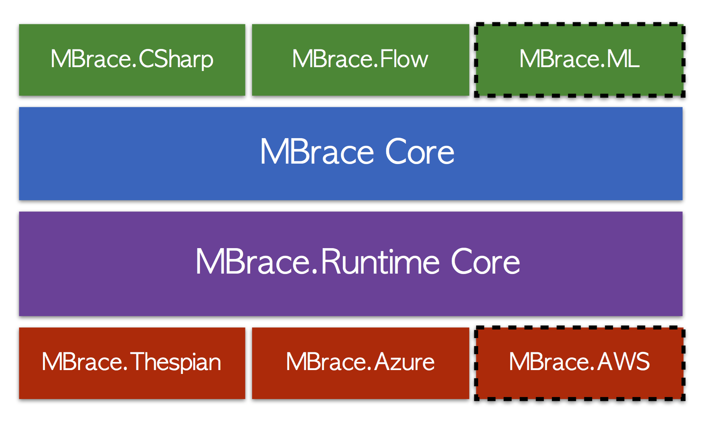

---

# MBrace Hack Day!

---

##Who am I?

### Isaac Abraham!

---

---

* .NET dev / contractor / consultant since .NET 1.0
* Director of Compositional IT
* F# developer since 2012
* Microsoft MVP in F# / .NET
* Based in Hessen & London

* email *[isaac@compositional-it.com](mailto:isaac@compositional-it.com)*
* twitter *[@isaac_abraham](https://twitter.com/isaac_abraham)*
* blog *http://cockneycoder.wordpress.com*

***

## Today's aims
* Learn how to use MBrace
* Learn a bit of F#
* Learn a bit about Azure

---

## Morgen
* Overview of MBrace
* Set of structured lessons
* Local development

' lessons will take you through the different areas of MBrace
' MBrace has a locally hosted mode. This afternoon we'll try to use MBrace.Azure!

---

## Nachmittag
* Data Hack
* Work with some **real** data sets
* Cluster hosted in Azure?
* Share results at the end of the day?

***

## What is MBrace

* General framework for distribution
* Compute, data or IO -bound workloads
* Works with any .NET language
* Written in F# (with recent C# SDK)
* Open source, free to use

---

## Use cases

* Batch Processing
    * Distributed compute workloads e.g. maths, finance
    * Big data workloads - unstructured data, ETLs etc.

* Real time & In Process
    * Simple "offloading" of background tasks

* Load testing
* "what-if" analysis
* usw usw usw :)

***

## F#? C#? WTF#?

* Why should you use F#?
* Why should you use F# with MBrace?
* You *can* use the C# SDK, but it's not as rich

' REPL
' Lightweight syntax
' Immutability
' cloud { }

---

## F# Primer in < 5 minutes

---

### Values

    // bind 5 to x
    let x:int = 5
    
    // type inference
    let inferredX = 5
    
    // functions are just values, don't need a class
    let helloWorld (name) = sprintf "Hello, %s" name 

    // type inference again
    let text = helloWorld "isaac"

---

### Types
    open System
    
    // Tuples are first class citizens in F#
    let person = Tuple.Create("Isaac", 36)
    let personShortHand = "isaac", 36 // string * int
    let name, age = personShortHand // decompose the tuple 

    // Declaring a record
    type Person = { Name : string; Age : int }
    
    // Create an instance
    let me = { Name = "Isaac"; Age = 36 }
    printfn "%s is %d years old" me.Name me.Age

---

### ACHTUNG!

---

### Whitespace sensitive 

    open System
     
    let prettyPrintTime() =
        let time = DateTime.UtcNow
        printfn "It is now %d:%d" time.Hour time.Minute

---

### Equals is comparison!

    let x = 5
    x = 10 // false, COMPARISON!!!
---

### Immutable by default

    let a = 10
    a <- 20 // not allowed

    let mutable y = 10 // immutable by default!
    y <- 20 // ok 
    
---

### REPL

* Read, Evaluate, Print Loop
* No console applications needed
* Scripts
* Explore domain quickly
* Convert to full-blown assemblies

---

### Also....

* Type Inference *everywhere*
* Expressions *everywhere*
* Type Providers

***

## What does MBrace look like?

---

## MBrace Packages

* Core libraries

    * MBrace.Core (core types and code)
    * MBrace.Runtime (runtime abstraction layer)
    * MBrace.Flow (big data)

* Runtime-specific

    * MBrace.Thespian
    * MBrace.Azure (runtime implementation of MBrace)
    * MBrace.Azure.Management (create clusters through scripts etc.)

---
    
## MBrace.Azure

---

## Core MBrace
    
    // Arbitrary computation
    cloud {
        let x = 1 + 2
        return x + 10 } // magic happens inside { }

    // Create a value and persist across all nodes
    CloudValue.New("Isaac", StorageLevel.Memory)
    
    // Write to a file
    CloudFile.WriteAllText("foo.txt", "Hello hello hello Berlin!") 

    // Distributed LINQ e.g. map reduce etc.
    CloudFlow.OfCloudFileByLine "foo.txt"
    |> CloudFlow.collect(fun line -> line.Split ' ')
    |> CloudFlow.map(fun word -> word.ToLower())
    |> CloudFlow.countBy id

---

## Cloud Computations

* Computations are Cloud< T> e.g. Cloud< string> etc.
* Think of this as a distributed version of Task< T>
* Send Cloud< T> to a cluster instead of thread pool for execution

    // Spin up a local 4-node cluster
    let cluster = ThespianCluster.InitOnCurrentMachine(4)

    // Just contains the unstarted cloud work item
    let computation : Cloud<string> = cloud { return "Hello World!")
    
    // Send computation to a cluster and get the result
    let text : string = cluster.Run(computation)  

***

## Resources

* This Repo - http://tiny.cc/spartakiade 
* MBrace Starter Kit - https://github.com/mbraceproject/MBrace.StarterKit/
* Sample datasets